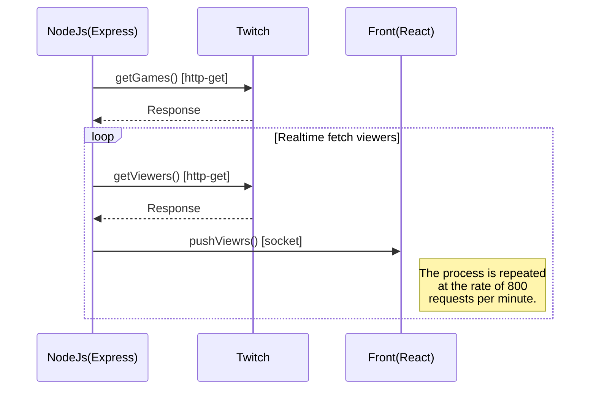

# Atecna - Test Developer Web Fullstack JS

# Demo
web: https://atecna-web-ahmed-ouali.herokuapp.com  
api: https://atecna-api-ahmed-ouali.herokuapp.com
# Installation
We have chosen to set up a monorepo project using [Lerna](https://github.com/lerna/lerna).    
You can launch the project by the following steps:

- npm install && lerna bootstrap
- npm run start-front (to start front(reactJs) application): http://localhost:3000
- npm run start-server (to start back(expressJs) application): http://localhost:3001

# UML diagrams

# Docs
[WEB](https://github.com/lerna/lerna)  
[API](https://github.com/lerna/lerna)
