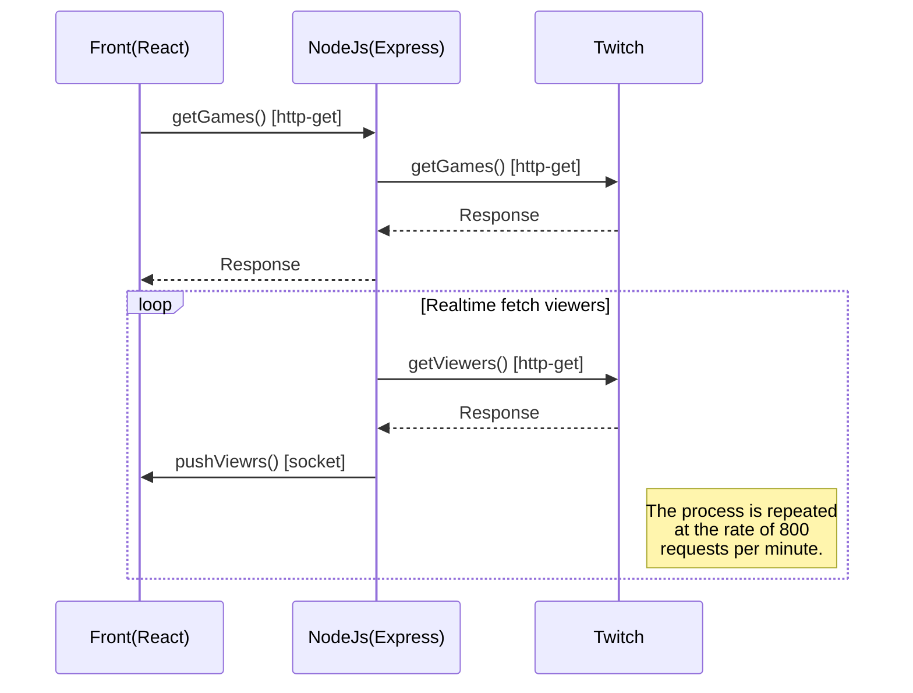

# Atecna - Test Developer Web Fullstack JS

# Demo
The project is hosted online using Heroku services 

Web: https://atecna-web-ahmed-ouali.herokuapp.com  
Api: https://atecna-api-ahmed-ouali.herokuapp.com

# Technologies


# Installation
  

**File Structure**
```
root(lerna)
│   package.json  
└───packages
    └───front
    │       package.json
    └───server
            package.json

```

We have chosen to set up a monorepo project using [Lerna](https://github.com/lerna/lerna).    
You can launch the project by the following steps:

- npm install && lerna bootstrap
- npm run start-front (to start front(reactJs) application): http://localhost:3000
- npm run start-server (to start back(expressJs) application): http://localhost:3001


# UML sequence diagram


# Documentation
- **[Front project documentation](https://gitlab.com/atecna/test-ouali-ahmed/-/blob/develop/packages/front/README.md)**  
- **[Api project documentation](https://gitlab.com/atecna/test-ouali-ahmed/-/blob/develop/packages/server/README.md)**
